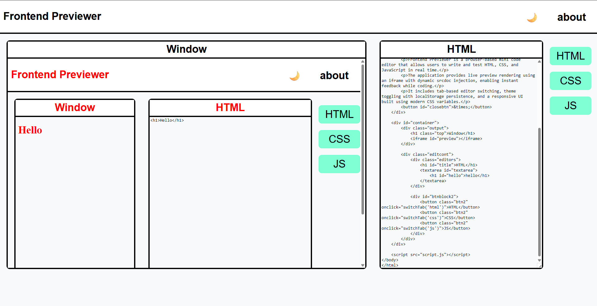

🚀 Frontend Previewer 
------------------------------------------------------------------------------------------------------------------------------------------------------
A lightweight browser-based code editor that allows users to write and test HTML, CSS, and JavaScript in real time with instant live preview rendering.
This project simulates a simplified CodePen-style environment using pure Vanilla JavaScript.

✨ Features
------------------------------------------------------------------------------------------------------------------------------------------------------
📝 Live editing for HTML, CSS, and JavaScript 
🔄 Real-time preview using dynamic iframe srcdoc 
🗂 Tab-based editor switching (HTML / CSS / JS) 
🌙 Dark/Light theme toggle with localStorage persistence 
🔐 Sandboxed script execution (iframe sandbox) 
💻 Responsive and clean UI 
📦 No external libraries — built with pure HTML, CSS & JS 

🖥️ Demo Preview
------------------------------------------------------------------------------------------------------------------------------------------------------
    User writes code → Editor captures input → 
    State updates → iframe injects combined code → Live Preview updates instantly

🛠 Tech Stack
------------------------------------------------------------------------------------------------------------------------------------------------------
  • HTML5
  • CSS3
    • Flexbox
    • CSS Variables
    • Transitions
  • JavaScript (Vanilla)
    • DOM Manipulation
    • Event Handling
    • localStorage
    • Template Literals
    • iframe srcdoc

📂 Project Structure
------------------------------------------------------------------------------------------------------------------------------------------------------
Frontend-Previewer/ 
│ 
├── index.html 
├── fp-style.css 
├── fp-script.js 
└── README.md 

⚙️ How It Works
------------------------------------------------------------------------------------------------------------------------------------------------------
  1️⃣ State Management
    The app stores code separately for: 
      • htmlCode 
      • cssCode 
      • jsCode 
When switching tabs, the current editor content is saved before loading the new language. 

2️⃣ Live Preview Rendering
  The preview updates dynamically using:
  
    preview.srcdoc = `
    <!DOCTYPE html>
    <html>
    <head>
    
    </head>
    <body>
    ${htmlCode}
    <script>
    ${jsCode}
    <\/script>
    </body>
    </html>
    `;
    
This injects user-written code directly into a sandboxed iframe.

3️⃣ Theme Persistence
  The selected theme is saved using:
  
    localStorage.setItem("theme", "dark");
      
On reload, the theme is restored automatically.

🔐 Security
------------------------------------------------------------------------------------------------------------------------------------------------------
  The preview window uses:
  
    <iframe sandbox="allow-scripts"></iframe>

This ensures:
  Scripts run safely
  No access to parent DOM
  Reduced XSS risks

📸 UI Overview
------------------------------------------------------------------------------------------------------------------------------------------------------

## 🌐 Live Demo
------------------------------------------------------------------------------------------------------------------------------------------------------
Experience the app live here:

👉 **Frontend Previewer:**  
[https://your-username.github.io/frontend-previewer/](https://topperguy7.github.io/frontend-previewer/)

No installation required — runs directly in the browser.

👨‍💻 Author
------------------------------------------------------------------------------------------------------------------------------------------------------
[topperguy] 
IT Engineering Student | Frontend Developer | JavaScript Enthusiast
